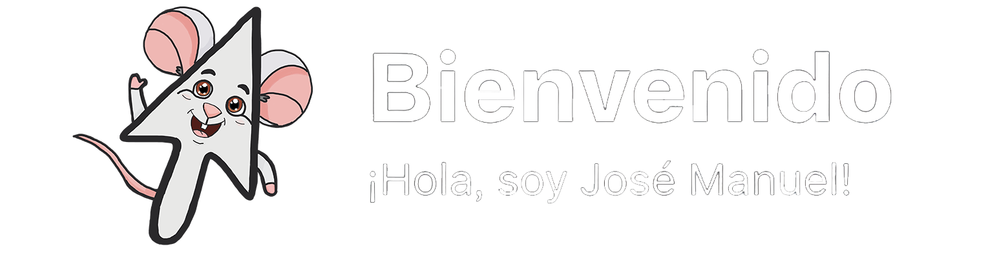

## Junior de Diseño y Desarrollo Web
> Cuando el código descansa, yo salgo a buscar historias: en series, en bocetos de dibujo, en paseos... y entre las páginas de un buen libro. ¡Soy un ratón de biblioteca con conexión Wi-Fi!

- Siempre estoy aprendiendo, experimentando con nuevas tecnologías.
- Soy un entusiasta del aprendizaje continuo y me fascina explorar las últimas tendencias en front-end y back-end.
- Mi objetivo es construir productos web que sean tanto visualmente atractivos como robustos en su funcionalidad.

- Siempre abierto a colaborar en nuevas ideas y oportunidades.
