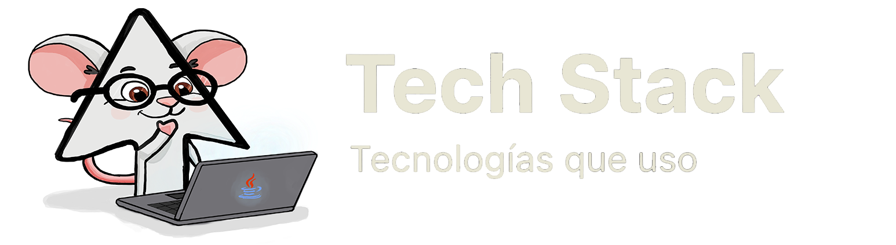

## Junior de Diseño y Desarrollo Web
> Cuando no estoy codificando, me encontrarás viendo series, paseando o leyendo como un ratón de biblioteca.

- Siempre estoy aprendiendo, experimentando con nuevas tecnologías.
- Soy un entusiasta del aprendizaje continuo y me fascina explorar las últimas tendencias en front-end y back-end.
- Mi objetivo es construir productos web que sean tanto visualmente atractivos como robustos en su funcionalidad.
- Siempre abierto a colaborar en nuevas ideas y oportunidades.

---

> Aquí están las tecnologías que estoy aprendiendo, dominando y ya domino. Porque hasta el ratón más curioso sabe que el buen código solo se hace dominando sus herramientas, siempre bien afiladas.

                   

---

> Cada commit es un paso más en mi madriguera de aprendizaje.
Aquí están mis proyectos, mis stats… y mi evolución como dev.

  
  

---

> Hasta el ratón más sabio sabe que las mejores ideas nacen en comunidad.
> 
> ¿Hablamos? 

